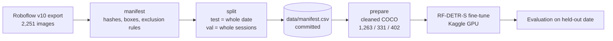

# Custom Object Detector

> Detects weightlifting plates by weight (0.5–25 kg) on a public dataset I audited and re-split
> after finding train/test leakage. RF-DETR-S fine-tuned on Kaggle, scored on a capture day the
> model never saw.

[](https://github.com/Prithv122/custom-detector/actions/workflows/ci.yml)

**Live demo:** not deployed yet
**Stack:** Python 3.12 · RF-DETR-S (Apache-2.0) · Roboflow (dataset source) · Kaggle GPU (training) · imagehash / NumPy (dataset audit)
**Status:** first training run done (one run, one seed); error analysis and demo pending.

---

## 1. The problem

Reading the weight on a loaded barbell from a photo — for automatic lift logging, or checking
that a bar was loaded as announced. The model has to name each plate's weight, not just find
"a plate": plates of different weight share a colour (25 kg and 2.5 kg are both red), so it has
to separate them by size and position on the sleeve.

## 2. The data

| | |
|---|---|
| Source | [*Weightlifting Plates*](https://universe.roboflow.com/projektciezary/weightlifting-plates) by ProjektCiezary, Roboflow Universe, **version 10** |
| Licence | **CC BY 4.0** (images and annotations, as published) |
| Size | 2,251 images / 11,453 boxes as published → **1,996 images / 10,173 boxes after cleaning** |
| Classes | `0.5kg` `1kg` `1.5kg` `2kg` `2.5kg` `5kg` `10kg` `15kg` `20kg` `25kg` + `zacisk` (collar) |
| Refresh | one-off, pinned to v10 |

Images are side-on close-ups of one loaded sleeve, mostly coloured competition/bumper plates on
a loading rig, taken on 7 dates between May and November 2025.

**Changes made to the dataset** (CC BY requires saying so):

| Removed | Images | Why |
|---|--:|---|
| `ZE_*` files | 225 | Crops of competition video footage — third-party imagery the uploader can't license |
| Numbered files (`1.jpg`, `31.webp`, …) | 25 | Press photos from international competitions — same reason |
| No boxes | 3 | Plates visible but unlabelled; would train them as background |
| One plate labelled as two weights | 2 | Contradictory labels |

The published train/valid/test split was **replaced** (next section). The kept images are the
phone-camera photos; the dataset page doesn't say who took them, and I haven't verified it.
Every image, its exclusion reason and its new split are in [`data/manifest.csv`](data/manifest.csv).

### Why the published split was replaced

Photos in this dataset come in sessions: one bar photographed over and over with a small plate
swapped between shots. The published split was random per image, so near-copies landed on both
sides: by a 256-bit perceptual hash, 315 images have a near-identical twin in a different split.
A model scored on that test set is partly scored on photos it trained on.

New split, grouped so near-copies can't cross it:

| Split | Images | Rule |
|---|--:|---|
| Train | 1,263 | everything not in val or test |
| Val | 331 | whole capture sessions (a gap of more than 5 min starts a new one) |
| Test | 402 | **one whole capture date (2025-05-04)**, never seen in training |

Each rule uses only dates, sessions and class counts, never model results. Every class has at
least 46 val and 70 test images. No pair of images in different splits is within 30 bits
(near-copies are ≤ 20). The test date is also the only one shot in portrait, with its own
backdrop — so test measures a new day *and* a slightly different setup.

## 3. Architecture



`src/detector/dataset/` has one module per box: `manifest.py`, `split.py`, `prepare.py`.

## 4. Key decisions & tradeoffs

| Decision | Chose | Over | Why |
|---|---|---|---|
| Data | Audited public dataset | Photographing ~225 of my own | Per-weight boxes already existed; the audit, not the collection, is where the judgement is. |
| Split | Whole date for test, whole sessions for val | The published random split | The random split leaks near-duplicates (315 images). |
| Classes | All 10 weights + collar | The 6 heaviest | Dropping the small plates would leave visible plates unboxed, i.e. labelled as background. |
| Questionable images | Excluded by rule, with reasons in the manifest | Trusting the dataset's CC BY label | A licence from the uploader can't cover broadcast footage or agency photos. |
| Detector | RF-DETR-S | Ultralytics YOLO | YOLO is AGPL-3.0; RF-DETR-S is Apache-2.0 and small enough to train on a free Kaggle GPU. |
| Near-duplicate test | 256-bit perceptual hash | 64-bit | At 64 bits every close-up of a bar sleeve looks alike (1,311 false cross-date matches). |

## 5. Results

One training run: RF-DETR-S, 50-epoch budget, early-stopped after epoch 39, best checkpoint
(epoch 36) chosen on val. Tesla T4, 162 min. Test = the held-out capture date, scored once.
`rfdetr` has no seed option, so this is a single sample; run-to-run spread is unmeasured.
Raw numbers: [`results/`](results/).

| | Val (best epoch) | Test (unseen date) | Gap |
|---|--:|--:|--:|
| mAP@50 | 0.993 | **0.953** | −0.040 |
| mAP@50–95 | 0.829 | **0.741** | −0.088 |
| Precision / recall | 0.976 / 0.972 | 0.916 / 0.963 | |

Per-class AP (@50–95):

| Class | Val | Test | Gap |
|---|--:|--:|--:|
| 25 kg | 0.936 | 0.891 | −0.045 |
| 20 kg | 0.908 | 0.864 | −0.044 |
| 15 kg | 0.926 | 0.851 | −0.075 |
| 10 kg | 0.892 | 0.825 | −0.067 |
| 5 kg | 0.734 | 0.685 | −0.048 |
| 2.5 kg | 0.757 | 0.706 | −0.051 |
| 2 kg | 0.748 | 0.698 | −0.049 |
| 1.5 kg | 0.842 | **0.611** | **−0.231** |
| 1 kg | 0.734 | 0.676 | −0.058 |
| 0.5 kg | 0.782 | **0.516** | **−0.265** |
| collar (`zacisk`) | 0.864 | 0.826 | −0.038 |

What this does and doesn't show so far:

- Nine of the eleven classes lose about 0.04–0.08 AP on the new day. **0.5 kg and 1.5 kg lose
  four to five times that.**
- Plates are smaller in the frame on the test date (portrait, uncropped): median box height
  drops from 0.23 to 0.16 of the image for small plates, and from 0.55 to 0.35 for 25 kg.
  But 1 kg and 2 kg shrink just as much and only lose ~0.05, so **size alone doesn't explain
  the two outliers.** Both share a colour with a heavier plate (0.5 / 5 kg white, 1.5 / 15 kg
  yellow), which is what the same-colour confusion analysis will test. Not yet measured.
- Val is optimistic by design: it shares capture dates with train. The test gap is the number
  that describes a new day.

Roboflow's hosted model for this dataset reports mAP@50 52%, but on the leaky split, so it is
not a comparable baseline.

## 6. How to run

```bash
git clone https://github.com/Prithv122/custom-detector.git
cd custom-detector
uv sync
uv run pytest            # split invariants are checked from the committed manifest
```

Rebuilding the dataset needs a free Roboflow API key:

```bash
cp .env.example .env                 # put ROBOFLOW_API_KEY in it
uv run custom-detector download      # v10 export → data/raw/ (git-ignored)
uv run custom-detector prepare       # cleaned, re-split COCO → data/processed/ (git-ignored)
uv run custom-detector summary       # split sizes, class coverage, cross-split duplicates
```

Training runs on a free Kaggle GPU: import `notebooks/train_rfdetr_kaggle.ipynb` into Kaggle,
set *Accelerator* to GPU T4, turn *Internet* on, add `ROBOFLOW_API_KEY` under *Secrets*, and run
all. It rebuilds the same cleaned split from the pinned export and the committed manifest,
checks it, trains RF-DETR-S, and writes metrics and val/test predictions to `results/`.

`uv run custom-detector manifest` rebuilds `data/manifest.csv` from the export. With the export
present, the test suite checks the rebuild matches the committed file exactly.

## 7. What I'd change at 100× scale

Pending — written after training.

---

## References

- Dataset: ProjektCiezary, *Weightlifting Plates* v10, Roboflow Universe, CC BY 4.0 —
  https://universe.roboflow.com/projektciezary/weightlifting-plates. Filtered and re-split as
  described in section 2.
- RF-DETR: Roboflow, Apache-2.0 — https://github.com/roboflow/rf-detr
- The original own-photo capture plan is archived in `data/archive/gym-capture/`.
