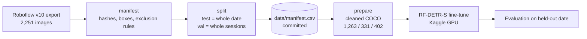

# Custom Object Detector

> Detects weightlifting plates by weight (0.5–25 kg) on a public dataset I audited and re-split
> after finding train/test leakage. RF-DETR-S fine-tuned on Kaggle, scored on a capture day the
> model never saw, with one failure on that day traced to scene colour and then reduced by a
> pre-registered colour-augmentation run.

[](https://github.com/Prithv122/custom-detector/actions/workflows/ci.yml)

**Demo:** runs locally on the published checkpoint (`uv run --extra demo custom-detector demo`, see section 6); not hosted anywhere
**Stack:** Python 3.12 · RF-DETR-S (Apache-2.0) · Albumentations (`PlanckianJitter`) · Roboflow (dataset source) · Kaggle GPU (training) · imagehash / NumPy (dataset audit, CIELAB measurements)
**Weights:** [Prithv122/custom-detector](https://huggingface.co/Prithv122/custom-detector) on the Hugging Face Hub (checkpoint 2A, with a model card)
**Status:** three training runs done (Run 1, then a control and a colour-augmented arm), each arm
with one seed. The colour-augmented checkpoint (2A) is the one selected to ship, and its weights
are published. A local demo app runs that checkpoint; there is no hosted version.

---

## 1. The problem

Reading the weight on a loaded barbell from a photo — for automatic lift logging, or checking
that a bar was loaded as announced. The model has to name each plate's weight, not just find
"a plate": plates of different weight share a colour (25 kg and 2.5 kg are both red), so it has
to separate them by size and position on the sleeve.

## 2. The data

| | |
|---|---|
| Source | [*Weightlifting Plates*](https://universe.roboflow.com/projektciezary/weightlifting-plates) by ProjektCiezary, Roboflow Universe, **version 10** |
| Licence | **CC BY 4.0** (images and annotations, as published) |
| Size | 2,251 images / 11,453 boxes as published → **1,996 images / 10,173 boxes after cleaning** |
| Classes | `0.5kg` `1kg` `1.5kg` `2kg` `2.5kg` `5kg` `10kg` `15kg` `20kg` `25kg` + `zacisk` (collar) |
| Refresh | one-off, pinned to v10 |

Images are side-on close-ups of one loaded sleeve, mostly coloured competition/bumper plates on
a loading rig, taken on 7 dates between May and November 2025.

**Changes made to the dataset** (CC BY requires saying so):

| Removed | Images | Why |
|---|--:|---|
| `ZE_*` files | 225 | Crops of competition video footage — third-party imagery the uploader can't license |
| Numbered files (`1.jpg`, `31.webp`, …) | 25 | Press photos from international competitions — same reason |
| No boxes | 3 | Plates visible but unlabelled; would train them as background |
| One plate labelled as two weights | 2 | Contradictory labels |

The published train/valid/test split was **replaced** (next section). The kept images are the
phone-camera photos; the dataset page doesn't say who took them, and I haven't verified it.
Every image, its exclusion reason and its new split are in [`data/manifest.csv`](data/manifest.csv).

### Why the published split was replaced

Photos in this dataset come in sessions: one bar photographed over and over with a small plate
swapped between shots. The published split was random per image, so near-copies landed on both
sides: by a 256-bit perceptual hash, 315 images have a near-identical twin in a different split.
A model scored on that test set is partly scored on photos it trained on.

New split, grouped so near-copies can't cross it:

| Split | Images | Rule |
|---|--:|---|
| Train | 1,263 | everything not in val or test |
| Val | 331 | whole capture sessions (a gap of more than 5 min starts a new one) |
| Test | 402 | **one whole capture date (2025-05-04)**, never seen in training |

Each rule uses only dates, sessions and class counts, never model results. Every class has at
least 46 val and 70 test images. No pair of images in different splits is within 30 bits
(near-copies are ≤ 20). The test date is also the only one shot in portrait, with its own
backdrop — so test measures a new day *and* a slightly different setup.

## 3. Architecture


```mermaid
flowchart LR
    A[Roboflow v10 export<br/>2,251 images] --> B[manifest<br/>hashes, boxes, exclusion rules]
    B --> C[split<br/>test = whole date<br/>val = whole sessions]
    C --> M[(data/manifest.csv<br/>committed)]
    M --> D[prepare<br/>cleaned COCO<br/>1,263 / 331 / 402]
    D --> E[RF-DETR-S fine-tune<br/>Kaggle GPU]
    E --> F[Evaluation on held-out date]
```

`src/detector/dataset/` has one module per box: `manifest.py`, `split.py`, `prepare.py`.

## 4. Key decisions & tradeoffs

| Decision | Chose | Over | Why |
|---|---|---|---|
| Data | Audited public dataset | Photographing ~225 of my own | Per-weight boxes already existed; the audit, not the collection, is where the judgement is. |
| Split | Whole date for test, whole sessions for val | The published random split | The random split leaks near-duplicates (315 images). |
| Classes | All 10 weights + collar | The 6 heaviest | Dropping the small plates would leave visible plates unboxed, i.e. labelled as background. |
| Questionable images | Excluded by rule, with reasons in the manifest | Trusting the dataset's CC BY label | A licence from the uploader can't cover broadcast footage or agency photos. |
| Detector | RF-DETR-S | Ultralytics YOLO | YOLO is AGPL-3.0; RF-DETR-S is Apache-2.0 and small enough to train on a free Kaggle GPU. |
| Near-duplicate test | 256-bit perceptual hash | 64-bit | At 64 bits every close-up of a bar sleeve looks alike (1,311 false cross-date matches). |
| Error analysis | Each question and its decision rule written and committed before the numbers were computed | Looking at results first | The first hypothesis (same-colour confusion) was wrong, and the written rule is what made that undeniable. |
| Augmentation | Global colour-temperature cast (`PlanckianJitter`, CIE D series, library defaults) | Hue / saturation jitter | Plate colour is part of the label (1.5 kg is yellow, 0.5 kg white). A hue rotation would teach the model that colour means nothing. A colour-temperature cast moves plate and scene together, the way light does. |
| Run 2 design | A control run on the same augmentation backend, same seed, no colour transform | Comparing the colour run to Run 1 | Any non-empty augmentation config switches `rfdetr` to a different resize backend, and Run 1 had no seed. Run 1 vs a colour run would change three things at once. |

## 5. Results

**Run 1** (the tables below, through the recolouring test): RF-DETR-S, 50-epoch budget,
early-stopped after epoch 39, best checkpoint (epoch 36) chosen on val. Tesla T4, 162 min. Test =
the held-out capture date, scored once. Run 1 set no seed, so it is a single sample. **Run 2**
follows after the recolouring test. Raw numbers: [`results/`](results/).

Which test numbers to trust for a *new* day: Run 1's. Nothing was tuned against that test date
when it was scored. Every Run 2 number is scored on a date whose errors chose the question (see
*Run 2*), so it measures the fix, not generalisation.

| | Val (best epoch) | Test (unseen date) | Gap |
|---|--:|--:|--:|
| mAP@50 | 0.993 | **0.953** | −0.040 |
| mAP@50–95 | 0.829 | **0.741** | −0.088 |
| Precision / recall | 0.976 / 0.972 | 0.916 / 0.963 | |

Per-class AP (@50–95):

| Class | Val | Test | Gap |
|---|--:|--:|--:|
| 25 kg | 0.936 | 0.891 | −0.045 |
| 20 kg | 0.908 | 0.864 | −0.044 |
| 15 kg | 0.926 | 0.851 | −0.075 |
| 10 kg | 0.892 | 0.825 | −0.067 |
| 5 kg | 0.734 | 0.685 | −0.048 |
| 2.5 kg | 0.757 | 0.706 | −0.051 |
| 2 kg | 0.748 | 0.698 | −0.049 |
| 1.5 kg | 0.842 | **0.611** | **−0.231** |
| 1 kg | 0.734 | 0.676 | −0.058 |
| 0.5 kg | 0.782 | **0.516** | **−0.265** |
| collar (`zacisk`) | 0.864 | 0.826 | −0.038 |

### Error analysis — one failure, two symptoms

The matching rules, the threshold rule and a decision rule were committed before any confusion
was counted (NOTES.md, *Evaluation protocol for Run 1*). `uv run custom-detector evaluate`
reproduces everything below into `results/evaluation.md` / `.json`.

- **Cross-check:** mAP@50 recomputed from the saved predictions is 0.954 on test (rfdetr: 0.953).
- **Threshold:** confidence 0.80, chosen on val (micro-F1 0.978), used unchanged on test.
- **The finding:** on the test date, **40 of 100 1.5 kg plates are labelled 0.5 kg**, and 21
  more are missed (recall 0.36). 0.5 kg itself has recall 1.00, but precision 0.715 — it is
  absorbing the 1.5 kg plates. The two weak classes are one error seen from both sides.
- **The hypothesis I pre-registered was wrong.** Same-colour confusion is essentially absent:
  1 of 100 (1.5 → 15 kg), 0 of 103 (0.5 → 5 kg); zero on val. The decision rule returns
  *mixed* (0.5 kg has no errors of its own to classify); the plain reading is that colour
  twins are not the problem. The confusion is between **size neighbours of different colour**
  (yellow 1.5 kg → white 0.5 kg).
- Every other class keeps recall ≥ 0.83 on test; the one other val weakness (22 of 118 2 kg
  → 1 kg) does not recur on test.

### Backdrop check — misread plates sit in front of the yellow backdrop

Looking at crops suggested that the misread 1.5 kg plates sit in front of the test date's
yellow-green backdrop. The measurement, the summary and a for / against / inconclusive rule
were committed before any pixel was measured (NOTES.md, *Backdrop check*).
`uv run custom-detector backdrop` reproduces it into `results/backdrop.md` / `.json`, and the
per-box values go to `results/backdrop_boxes.csv`.

- **Measure:** median CIELAB b\* (blue −, yellow +) of a ring around each test 1.5 kg box.
  All labelled boxes are masked out, so neighbouring plates don't count as background.
- **Result: pre-registered verdict *for*.** AUC 0.715 (95% CI 0.574–0.848, bootstrap over
  whole images) that a misread plate has a yellower backdrop than a correctly read one. Ring
  b\* median: misread **45.2** (IQR 43.0–47.4), correct **−4.7** (IQR −12.4 to 48.3).
- **Exploratory, cut-off chosen afterwards:** all 40 misreads have a yellow backdrop
  (b\* > 30). On yellow, 12 plates are read correctly, 40 are misread and 15 are missed.
  Against any other backdrop the counts are 24, 0 and 6. A yellow backdrop is close to
  necessary for the error, but it doesn't guarantee it.
- **Limits:** one date, one run, association only. Each test photo holds a single 1.5 kg
  plate, so the planned same-photo control had no pairs, and backdrop can't be separated
  from everything else about a photo. The cheapest causal test is to recolour the backdrop
  around misread plates and re-run inference, which is the next section.

### Recolouring test — the scene colour, not the strip next to the plate

Same Run 1 checkpoint, same images, same plate pixels; only the backdrop colour changes, in
memory. The arms, the target colours and the decision rule were committed before any image was
altered (NOTES.md, *Recolouring test*). `uv run custom-detector recolour` reproduces it into
`results/recolour.md` / `.json`.

- **Gate first:** the local CPU pipeline reproduced Run 1's outcome on all 76 unaltered boxes in
  the arms (0 dropped), so flips are measured against a trustworthy baseline.
- **Result: pre-registered verdict *for (scene)*.** Of the 40 misread plates, recolouring every
  non-box pixel in the image to the blue backdrop's colour flips **24 (60%, CI 45–74%)** to a
  correct 1.5 kg read. Recolouring only a ring around the plate flips **2 (5%, CI 1–17%)**, and
  28 of those 40 come back as no detection at all. A round-trip that changes nothing (sham)
  flips 0 of 40, so the pipeline isn't generating the effect.
- **Not decisive, reported anyway:** recolouring the ring of already-correct yellow-backdrop
  plates left 14 of 17 correct. The yellow direction (blue → yellow) flipped 6 of 19 but with a
  median 73% of ring pixels clipped, since a dark blue can't reach that yellow inside the sRGB
  range, so it is an approximate recolour.
- **Limits:** this changes the surroundings only, so it can't test "yellow light made the plate
  itself look pale". One checkpoint, one date. A flip shows the model's read depends on scene
  colour. It does not show what in the real scene produced that colour.

### Run 2 — colour-cast augmentation, scored against a control

The question, both arms, the guardrails and the decision rule were committed before any
training (NOTES.md, *Run 2*). Two Kaggle runs on one commit, identical except for the colour
transform. `uv run custom-detector run2-eval` reproduces the scoring into
`results/run2_evaluation.md` / `.json`.

| Arm | Augmentation | Role |
|---|---|---|
| **2C** control | horizontal flip | Run 1's augmentation, on the Albumentations backend |
| **2A** colour | horizontal flip + `PlanckianJitter` (CIE D, 4000–15000 K, p = 0.5) | treatment |

Everything else is Run 1's configuration, checked field by field against Run 1's saved config
(any difference voids the run). One seed per arm (20261001). Each arm uses its own confidence
threshold, chosen on its own val by Run 1's rule.

**Primary: the 100 test 1.5 kg boxes** (every test photo holds exactly one).

| Run | Threshold | Read as 1.5 kg | Read as 0.5 kg (misread) | Missed | Other |
|---|--:|--:|--:|--:|--:|
| Run 1 (reference) | 0.80 | 36 | 40 | 21 | 3 |
| 2C control | 0.67 | 40 | 51 | 6 | 3 |
| 2A colour | 0.53 | **72** | **25** | 0 | 3 |

- **Pre-registered verdict: fixed.** 2A misreads 25 against the control's 51. The rule required
  at most 25 (half, rounded down), so this clears the bar with no slack: one more misread and
  the verdict would have been *not fixed*. Paired on the same 100 boxes, 26 are misread by the
  control only and none by 2A only (exact McNemar, one-sided, p = 1.5e-8). The gain went to
  correct reads (+32), not to misses.
- **Guardrails held**, 2A against 2C: test mAP@50–95 0.762 vs 0.748, val 0.821 vs 0.823, and
  no other class's test AP@50–95 dropped by more than 0.011 (limit 0.05).
- **Where it shows up:** on photos with the yellow backdrop, misreads fell 51 → 25 and correct
  reads rose 17 → 49. On the blue backdrop nothing changed (0 misreads, 23 correct, both
  arms). All 25 remaining misreads are on the yellow side. 0.5 kg precision: 0.715 (Run 1),
  0.660 (2C), 0.769 (2A).
- **The failure was not a one-off:** the control, retrained without any colour change,
  misreads 51, more than Run 1's 40. That is also a measure of how much a retrain moves this
  number (11 on misreads, 15 on misses), and it is the scale to read the 26-box gap against.
- **Not a cure:** 25 of 100 test 1.5 kg plates are still read as 0.5 kg.

**What this cannot show:**

- **The test date was used for diagnosis.** Its errors chose the question, two analyses measured
  its images, and the fix is scored on it. These numbers say whether the known failure is
  reduced on this date, not how the model does on a new one. This dataset has no untouched date
  left, so there is no clean number for the shipped checkpoint. Run 1's test scores, taken before
  any of this, are the cleaner estimate.
- **One seed per arm.** McNemar accounts for which boxes are in the test set, not for training
  randomness. The Run 1 vs control gap above is the only look at the second.
- **Success does not show that lighting was the physical cause.** The augmentation simulates the
  colour of the light, so a fix supports "robustness to scene colour helps". It doesn't show that
  white balance or illumination caused the failure on that day. It also shifts plate and
  backdrop together, whereas the recolouring test changed only the surroundings.
- **The arms used different confidence thresholds** (0.67 and 0.53), each picked on that arm's
  own val by a rule fixed before training, so this is part of the frozen evaluation. For context,
  2A at 0.53 has 12 predictions that match no labelled box and the control has none. An
  equal-threshold comparison was not pre-registered and was not performed.

Val is optimistic by design: it shares capture dates with train. The test gap is the number
that describes a new day.

Roboflow's hosted model for this dataset reports mAP@50 52%, but on the leaky split, so it is
not a comparable baseline.

## 6. How to run

```bash
git clone https://github.com/Prithv122/custom-detector.git
cd custom-detector
uv sync
uv run pytest            # split invariants are checked from the committed manifest
```

The demo runs the published 2A checkpoint on CPU, with no dataset or API key needed:

```bash
uv run --extra demo custom-detector demo     # http://127.0.0.1:7860, this machine only
```

The first run downloads the 128 MB checkpoint from the Hub at the pinned commit and checks its
SHA-256 before loading it. The confidence slider starts at 0.53, the value chosen on the
validation split. The model runs once per photo and the slider only filters its detections.
`--examples <folder>` adds clickable photos from a local folder (for instance
`data/processed/plates_v10_clean/test` after `prepare`); no photos are shipped in the repo.

Rebuilding the dataset needs a free Roboflow API key:

```bash
cp .env.example .env                 # put ROBOFLOW_API_KEY in it
uv run custom-detector download      # v10 export → data/raw/ (git-ignored)
uv run custom-detector prepare       # cleaned, re-split COCO → data/processed/ (git-ignored)
uv run custom-detector summary       # split sizes, class coverage, cross-split duplicates
```

Training runs on a free Kaggle GPU: import `notebooks/train_rfdetr_kaggle.ipynb` into Kaggle,
set *Accelerator* to GPU T4, turn *Internet* on, add `ROBOFLOW_API_KEY` under *Secrets*, and run
all. It rebuilds the same cleaned split from the pinned export and the committed manifest,
checks it, trains RF-DETR-S, and writes metrics and val/test predictions to `results/`. For Run 2
the notebook has a `RUN` switch (`"2C"` control, `"2A"` colour); both arms ran on the pinned commit
it names.

With the Run 1 checkpoint and the export in place, the analyses reproduce locally:

```bash
uv run custom-detector evaluate     # Run 1 error analysis
uv run custom-detector backdrop     # backdrop check
uv run custom-detector recolour     # recolouring test (CPU inference)
uv run custom-detector run2-eval    # Run 2 scoring, from results/run2a and results/run2c
```

The published 2A checkpoint can be checked against the Hub (download at a pinned revision,
SHA-256, CPU inference on the 100 test 1.5 kg boxes compared with the Kaggle predictions):

```bash
uv run python scripts/verify_hf_checkpoint.py --revision be16623ab1de46cc2e2b9e4df477af5d71d04c58
```

`uv run custom-detector manifest` rebuilds `data/manifest.csv` from the export. With the export
present, the test suite checks the rebuild matches the committed file exactly.

## 7. What I'd change at 100× scale

Pending — written after training.

---

## References

- Dataset: ProjektCiezary, *Weightlifting Plates* v10, Roboflow Universe, CC BY 4.0 —
  https://universe.roboflow.com/projektciezary/weightlifting-plates. Filtered and re-split as
  described in section 2.
- RF-DETR: Roboflow, Apache-2.0 — https://github.com/roboflow/rf-detr
- The original own-photo capture plan is archived in `data/archive/gym-capture/`.
